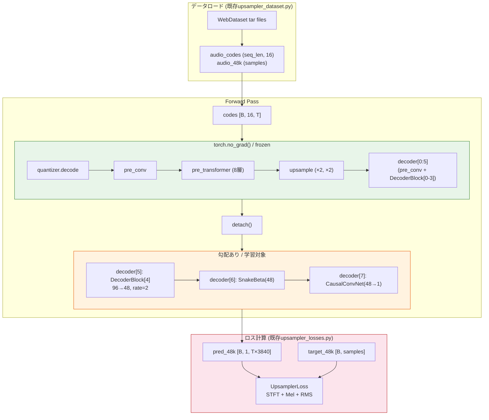

# DecoderBlock追加方式による48kHzトレーニング計画

## 概要

既存の `Qwen3TTSTokenizerV2Decoder` の `upsample_rates` を `[8,5,4,3]` → `[8,5,4,3,2]` に変更することで、upstreamコードの変更なしに48kHz出力を実現する。トレーニング後のモデルは、標準の `Qwen3TTSTokenizerV2Model` としてそのまま利用でき、カスタムコード不要で配布可能。

## 現行UpSamplerBlock方式との比較

| 項目 | UpSamplerBlock方式 (現在) | DecoderBlock追加方式 (新規) |
|------|--------------------------|---------------------------|
| upstream変更 | `tokenizer_48k/` にカスタムコード必要 | **不要** (config変更のみ) |
| model_type | `qwen3_tts_tokenizer_48k` (カスタム) | `qwen3_tts_tokenizer_12hz` (upstream) |
| 配布時 | `trust_remote_code=True` 必要 | **標準の `AutoModel.from_pretrained` で利用可能** |
| 追加パラメータ | ~17K (0.01%) | ~60K (後述) |
| 学習コスト | 低 (upsampler部のみ) | 中 (DecoderBlock + 最終層) |
| 既存重み再利用 | 全パラメータ再利用可 | decoder[0:5]は再利用可、最終3層は再学習 |

## アーキテクチャ

### 既存 (24kHz): `upsample_rates=[8,5,4,3]`

```
self.decoder = nn.ModuleList([
    [0] CausalConvNet(1024→1536, k=7),         # frozen
    [1] DecoderBlock(0): 1536→768,  rate=8,     # frozen
    [2] DecoderBlock(1): 768→384,   rate=5,     # frozen
    [3] DecoderBlock(2): 384→192,   rate=4,     # frozen
    [4] DecoderBlock(3): 192→96,    rate=3,     # frozen
    [5] SnakeBeta(96),                          # frozen
    [6] CausalConvNet(96→1, k=7),              # frozen
])
```

### 新規 (48kHz): `upsample_rates=[8,5,4,3,2]`

```
self.decoder = nn.ModuleList([
    [0] CausalConvNet(1024→1536, k=7),         # frozen ← 既存重み
    [1] DecoderBlock(0): 1536→768,  rate=8,     # frozen ← 既存重み
    [2] DecoderBlock(1): 768→384,   rate=5,     # frozen ← 既存重み
    [3] DecoderBlock(2): 384→192,   rate=4,     # frozen ← 既存重み
    [4] DecoderBlock(3): 192→96,    rate=3,     # frozen ← 既存重み
    [5] DecoderBlock(4): 96→48,     rate=2,     # ★ 学習対象 (NEW)
    [6] SnakeBeta(48),                          # ★ 学習対象 (NEW)
    [7] CausalConvNet(48→1, k=7),              # ★ 学習対象 (NEW)
])
```

### 重みロードの動作 (`load_state_dict(strict=False)`)

```
基底モデルの state_dict        →  新モデルへのマッピング
─────────────────────────────────────────────────────
decoder.0.* (CausalConvNet)    →  decoder.0.* ✓ 一致
decoder.1.* (DecoderBlock[0])  →  decoder.1.* ✓ 一致
decoder.2.* (DecoderBlock[1])  →  decoder.2.* ✓ 一致
decoder.3.* (DecoderBlock[2])  →  decoder.3.* ✓ 一致
decoder.4.* (DecoderBlock[3])  →  decoder.4.* ✓ 一致
decoder.5.alpha (SnakeBeta96)  →  ✗ unexpected (新decoder.5はDecoderBlock)
decoder.5.beta                 →  ✗ unexpected
decoder.6.conv.* (Conv96→1)    →  ✗ unexpected (新decoder.6はSnakeBeta48)

新モデルの missing keys:
  decoder.5.block.*            ← DecoderBlock[4] (ランダム初期化)
  decoder.6.alpha/beta         ← SnakeBeta(48) (ランダム初期化)
  decoder.7.conv.*             ← CausalConvNet(48→1) (ランダム初期化)
```

→ `load_state_dict(strict=False)` で正しく動作する。

### 追加パラメータ数の見積もり

```
DecoderBlock[4] (rate=2, 96→48):
  SnakeBeta(96):                    96 × 2 =       192
  CausalTransConvNet(96→48, k=4):  96 × 48 × 4 = 18,432 + 48 bias = 18,480
  ResidualUnit(48, d=1):
    SnakeBeta(48):     48 × 2 =      96
    CausalConv(48→48, k=7):         48 × 48 × 7 = 16,128 + 48 = 16,176
    SnakeBeta(48):     48 × 2 =      96
    CausalConv(48→48, k=1):         48 × 48 × 1 = 2,304 + 48 = 2,352
  ResidualUnit(48, d=3):             同上 = 18,720
  ResidualUnit(48, d=9):             同上 = 18,720

Final layers:
  SnakeBeta(48):                    48 × 2 =       96
  CausalConvNet(48→1, k=7):        48 × 1 × 7 =   336 + 1 = 337

合計: 約 95,000 params
```

## ファイル構成

```
finetuning/decoder_block_48k/
├── train.py           # トレーニングスクリプト
├── merge.py           # 学習済み重みを統合して完全モデルを作成
├── inference.py       # 推論スクリプト
└── train.sh           # 学習実行用シェルスクリプト
```

共有モジュール (既存を再利用):
- `finetuning/tokenizer48k/upsampler_dataset.py` → データセット
- `finetuning/tokenizer48k/upsampler_losses.py` → ロス関数

## 実装計画

### Step 1: `train.py` - トレーニングスクリプト

既存の `finetuning/tokenizer48k/train_upsampler.py` をベースに作成。

#### 主な変更点

**1. モデル作成 (`create_model`)**

```python
def create_model(args, accelerator):
    # 1. 基底24kHzモデルをロード
    tokenizer = Qwen3TTSTokenizer.from_pretrained(
        args.decoder_model_path,
        attn_implementation="eager",
        dtype=torch.bfloat16,
        device_map="cpu",
    )
    base_decoder = tokenizer.model.decoder
    base_state_dict = base_decoder.state_dict()

    # 2. 48kHz config作成 (upstreamのDecoderConfigをそのまま使用)
    config_dict = base_decoder.config.to_dict()
    config_dict["upsample_rates"] = list(config_dict["upsample_rates"]) + [2]
    decoder_config = Qwen3TTSTokenizerV2DecoderConfig(**config_dict)

    # 3. 新デコーダーを作成 (upstreamクラスをそのまま使用)
    decoder = Qwen3TTSTokenizerV2Decoder(decoder_config).to(torch.bfloat16)

    # 4. 基底重みをロード (strict=False)
    missing, unexpected = decoder.load_state_dict(base_state_dict, strict=False)

    # 5. フリーズ設定
    num_frozen_decoder_modules = len(base_decoder.decoder)  # 7 (= 4 blocks + pre_conv + snake + out_conv)
    freeze_model(decoder, num_frozen_decoder_modules)

    del tokenizer, base_decoder
    gc.collect()

    return decoder
```

**2. フリーズ戦略 (`freeze_model`)**

```python
def freeze_model(decoder, num_frozen_decoder_modules):
    """decoder[0:num_frozen]をフリーズし、残りを学習対象にする"""
    # まず全パラメータをフリーズ
    for param in decoder.parameters():
        param.requires_grad = False

    # 新しいdecoder modulesのみ学習対象にする
    for i in range(num_frozen_decoder_modules, len(decoder.decoder)):
        for param in decoder.decoder[i].parameters():
            param.requires_grad = True
```

**3. トレーニング用forward ラッパー**

VRAM節約のため、フリーズ部分を `torch.no_grad()` で実行する。

```python
class DecoderTrainingWrapper(nn.Module):
    """学習時にフリーズ部分をno_gradで実行するラッパー"""

    def __init__(self, decoder, num_frozen_decoder_modules):
        super().__init__()
        self.decoder = decoder
        self.freeze_idx = num_frozen_decoder_modules

    def forward(self, codes):
        # フリーズ部分: no_gradで実行 (VRAM節約)
        with torch.no_grad():
            hidden = self.decoder.quantizer.decode(codes)
            hidden = self.decoder.pre_conv(hidden).transpose(1, 2)
            hidden = self.decoder.pre_transformer(
                inputs_embeds=hidden
            ).last_hidden_state
            hidden = hidden.permute(0, 2, 1)
            for blocks in self.decoder.upsample:
                for block in blocks:
                    hidden = block(hidden)
            wav = hidden
            for block in self.decoder.decoder[:self.freeze_idx]:
                wav = block(wav)
        wav = wav.detach()

        # 学習対象部分: 勾配あり
        for block in self.decoder.decoder[self.freeze_idx:]:
            wav = block(wav)

        return wav.clamp(min=-1, max=1)
```

**4. チェックポイント保存**

学習対象パラメータのみ保存:
```python
def save_checkpoint(model, ...):
    unwrapped = accelerator.unwrap_model(model)
    decoder = unwrapped.decoder

    # 新しいdecoder modulesの重みのみ保存
    trainable_state_dict = {}
    for i in range(freeze_idx, len(decoder.decoder)):
        prefix = f"decoder.{i}."
        for k, v in decoder.state_dict().items():
            if k.startswith(prefix):
                trainable_state_dict[k] = v.cpu()

    save_file(trainable_state_dict, checkpoint_dir / "decoder_block.safetensors")

    # config保存
    config = {
        "base_upsample_rates": [8, 5, 4, 3],
        "new_upsample_rates": [8, 5, 4, 3, 2],
        "num_frozen_decoder_modules": freeze_idx,
        "step": step,
        "epoch": epoch,
    }
```

**5. データセット・ロス関数**

既存モジュールをそのまま再利用:
```python
from finetuning.tokenizer48k.upsampler_dataset import create_webdataset_loader
from finetuning.tokenizer48k.upsampler_losses import UpsamplerLoss
```

**6. コマンドライン引数の変更点**

```diff
- --upsampler_hidden_dim    (削除: DecoderBlockはconfig由来)
- --upsampler_kernel_size   (削除: 同上)
+ --extra_upsample_rate     (追加: デフォルト=2, 追加するアップサンプルレート)
```

### Step 2: `merge.py` - マージスクリプト

学習済みの新DecoderBlock重みを基底モデルに統合して、完全な48kHzモデルを作成。

```python
def merge_model(base_model_path, checkpoint_path, output_path):
    # 1. 基底モデルのconfigをロード
    base_config = json.load(open(base_model_path / "speech_tokenizer/config.json"))

    # 2. configを48kHz用に更新
    base_config["output_sample_rate"] = 48000
    base_config["decode_upsample_rate"] = 3840
    base_config["decoder_config"]["upsample_rates"] = [8, 5, 4, 3, 2]
    # model_typeはそのまま "qwen3_tts_tokenizer_12hz"

    # 3. 基底重みをロード
    base_state_dict = load_file(base_model_path / "speech_tokenizer/model.safetensors")

    # 4. 学習済み重みをマージ
    #    - 基底モデルの decoder.5.* (旧SnakeBeta96), decoder.6.* (旧Conv96→1) を削除
    #    - 学習済みの decoder.5.*, decoder.6.*, decoder.7.* を追加
    checkpoint_state_dict = load_file(checkpoint_path / "decoder_block.safetensors")

    # 旧最終層を削除
    keys_to_remove = [k for k in base_state_dict
                      if k.startswith("decoder.decoder.5.") or k.startswith("decoder.decoder.6.")]
    for k in keys_to_remove:
        del base_state_dict[k]

    # 新しい重みを追加
    for k, v in checkpoint_state_dict.items():
        base_state_dict[f"decoder.{k}"] = v

    # 5. 保存
    save_file(base_state_dict, output_path / "model.safetensors")
    json.dump(base_config, open(output_path / "config.json", "w"), indent=2)
```

### Step 3: `inference.py` - 推論スクリプト

2つの推論方法をサポート:

**方法1: マージ済みモデル (推奨)**

```python
# 標準のupstreamコードで動作
tokenizer = Qwen3TTSTokenizer.from_pretrained("output/merged-48k-model")
audio_codes = torch.tensor(np.load("codes.npy")).unsqueeze(0)
result = tokenizer.model.decode(audio_codes)
# result.audio_values[0] は48kHz波形
```

**方法2: チェックポイントから復元**

```python
# 基底モデル + 学習済みチェックポイントから48kHzモデルを復元
tokenizer = Qwen3TTSTokenizer.from_pretrained(base_model_path)
decoder = tokenizer.model.decoder

# configを48kHz用に更新して新デコーダーを作成
config_dict = decoder.config.to_dict()
config_dict["upsample_rates"] = [8, 5, 4, 3, 2]
new_config = Qwen3TTSTokenizerV2DecoderConfig(**config_dict)
new_decoder = Qwen3TTSTokenizerV2Decoder(new_config)

# 重みをロード
new_decoder.load_state_dict(decoder.state_dict(), strict=False)
checkpoint = load_file(checkpoint_path / "decoder_block.safetensors")
new_decoder.load_state_dict(checkpoint, strict=False)

# デコーダーを差し替え
tokenizer.model.decoder = new_decoder
tokenizer.model.decode_upsample_rate = 3840
tokenizer.model.output_sample_rate = 48000
```

### Step 4: `train.sh` - 学習実行スクリプト

```bash
#!/bin/bash
accelerate launch finetuning/decoder_block_48k/train.py \
    --train_shards "data/train-*.tar" \
    --val_shards "data/val-*.tar" \
    --output_dir output/decoder_block_48k \
    --batch_size 32 \
    --lr 1e-4 \
    --max_train_steps 500000 \
    --max_audio_length 5.0 \
    --l1_weight 0.0 \
    --stft_weight 1.0 \
    --mel_weight 1.0 \
    --rms_weight 10.0
```

## トレーニングフロー



## マージ後の config.json

```json
{
  "architectures": ["Qwen3TTSTokenizerV2Model"],
  "model_type": "qwen3_tts_tokenizer_12hz",
  "input_sample_rate": 24000,
  "output_sample_rate": 48000,
  "decode_upsample_rate": 3840,
  "encode_downsample_rate": 1920,
  "encoder_valid_num_quantizers": 16,
  "decoder_config": {
    "upsample_rates": [8, 5, 4, 3, 2],
    "upsampling_ratios": [2, 2],
    "decoder_dim": 1536,
    "latent_dim": 1024,
    "codebook_dim": 512,
    "codebook_size": 2048,
    "num_quantizers": 16,
    "hidden_size": 512,
    "num_hidden_layers": 8,
    "num_attention_heads": 16,
    "num_key_value_heads": 16,
    "head_dim": 64,
    "intermediate_size": 1024,
    "hidden_act": "silu",
    "sliding_window": 72,
    "max_position_embeddings": 8000,
    "rope_theta": 10000,
    "layer_scale_initial_scale": 0.01,
    "rms_norm_eps": 1e-05,
    "attention_bias": false,
    "attention_dropout": 0.0
  },
  "encoder_config": {
    "...": "(既存encoder configそのまま)"
  }
}
```

ポイント: `model_type` が `qwen3_tts_tokenizer_12hz` のまま。upstreamの transformers で直接ロード可能。

## ユーザーの利用方法 (マージ後)

```python
# カスタムコード不要！標準の transformers/AutoModel で利用可能
from transformers import AutoModel

model = AutoModel.from_pretrained("someone/Qwen3-TTS-Tokenizer-12Hz-48kHz")
# → 自動的に upsample_rates=[8,5,4,3,2] で構築され、48kHz出力

# または Qwen3TTSTokenizer ラッパー経由
from qwen_tts import Qwen3TTSTokenizer
tokenizer = Qwen3TTSTokenizer.from_pretrained("someone/Qwen3-TTS-Tokenizer-12Hz-48kHz")
result = tokenizer.model.decode(audio_codes)
# result.audio_values[0] は48kHz (sample_rate=48000)
```

## 実装の優先順位

| 順序 | ファイル | 内容 | 難易度 |
|:---:|----------|------|:-----:|
| 1 | `train.py` | トレーニングスクリプト | 中 |
| 2 | `merge.py` | 重みマージスクリプト | 低 |
| 3 | `inference.py` | 推論スクリプト | 低 |
| 4 | `train.sh` | 学習実行シェルスクリプト | 低 |

### 依存関係

```
train.py
├── finetuning/tokenizer48k/upsampler_dataset.py  (既存・変更なし)
├── finetuning/tokenizer48k/upsampler_losses.py    (既存・変更なし)
└── qwen_tts/core/tokenizer_12hz/                  (upstream・変更なし)

merge.py
└── safetensors

inference.py
└── qwen_tts/core/tokenizer_12hz/                  (upstream・変更なし)
```

## 注意事項

1. **upstreamコードは一切変更しない** - `qwen_tts/core/tokenizer_12hz/` は触らない
2. **chunked_decode対応** - `total_upsample` は `np.prod(upsample_rates + upsampling_ratios)` で自動計算されるため、chunked_decodeも正しく動作する
3. **VRAM最適化** - フリーズ部分を `torch.no_grad()` + `detach()` で実行し、中間activationを保持しない
4. **学習済みモデルの互換性** - マージ後のモデルは `Qwen3TTSTokenizerV2Model` として完全に動作し、encoderも含めてencode/decodeの全パイプラインが利用可能
